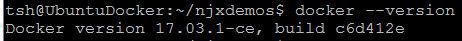
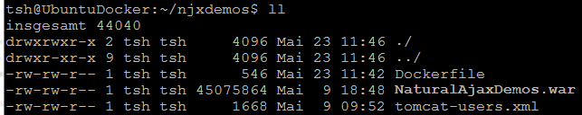
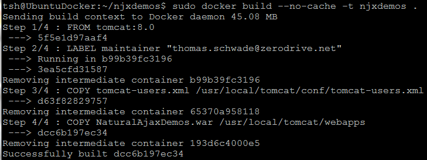
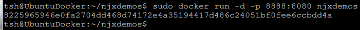
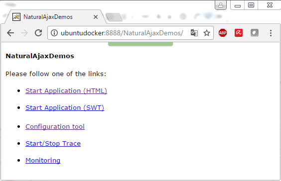
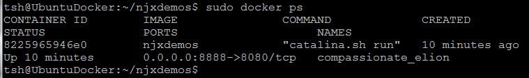
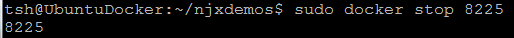

##### Thomas Schwade - May 23, 2017

## Running Natural Ajax in a Docker Container

### Why Docker?

An essential building block in the DevOps concept is the idea of "infrastructure as code". Getting an application into production requires not only the application code and assets, but also a suitably configured execution environment. A Natural AJAX application, for instance, requires an Apache Tomcat servlet container that is configured in a way that fits the application's requirements.

[Docker](https://www.docker.com/ "Docker") allows specifying the necessary infrastructure and configuration for an application and provides the tools needed to package the application together with the required infrastructure into a *container*. A container can then be deployed for execution an arbitrary physical or virtual machine where Docker is installed.

All required configuration files describing the execution environment for an application can thus be kept in one place (usually a version control system), where it can be maintained by a combined team of developers and operators.

But let us look at a practical example.

### What do we want to achieve?

We start at the point where "usually" the job of the developers ends and the job of the operating people starts. That is to say: We have a readily built Natural Ajax web application, for instance the Natural AJAX Demos: *NaturalAjaxDemos.war*. 

### A playground for the first steps

First of all we need a machine where Docker is installed. For this example I used an Oracle VirtualBox VM, running Ubuntu 16.04. On this VM I installed Docker as described in [https://docs.docker.com/engine/installation/linux/ubuntu/](https://docs.docker.com/engine/installation/linux/ubuntu/ "https://docs.docker.com/engine/installation/linux/ubuntu/")

We check if Docker is correctly installed:

### Creating the container

As infrastructure for our application we need a suitably configured Tomcat server. [Docker Hub](https://hub.docker.com/) provides a lot of ready made images that we can use to build our container. We specify our container in the so-called *Dockerfile*.

As a basis for our new container we use the image tomcat:8.0 from [Docker Hub](https://hub.docker.com/)

Contents of *Dockerfile*:

	# Use this image as basis for our container.
	FROM tomcat:8.0
	#
	# This is optional. There are many other LABELs possible.
	LABEL maintainer "thomas.schwade@zerodrive.net"
	#
	# The tomcat:8.0 image contains the tomcat files under /usr/local/tomcat
	# We provide our own tomcat-users.xml file with a predefined administrator account.
	# We can of course provide any other specific configuration file too.
	COPY tomcat-users.xml /usr/local/tomcat/conf/tomcat-users.xml
	#
	# We deploy our web application.
	COPY NaturalAjaxDemos.war /usr/local/tomcat/webapps

We need to have the tomcat-users.xml file and the NaturalAjaxDemos.war in the same directory as the Dockerfile.

We build the container:

The builder executes the steps in the Dockerfile and creates the new container. It stores intermediate build results in a cache. If we later need to rebuild the container, we can omit the --no-cache option, so that unchanged intermediate build results are reused.

### Running the container

Now we can deploy and run the container: 

Now the container is running in its own virtual machine. What does the parameter -p 8888:8080 mean? The tomcat:8.0 image we used as starting point for our container exposes a HTTP connecttor at port 8080. With the parameter -p 8888:8080 we map that port on the port 8888 on the *host* machine (here: *UbuntuDocker*). Thus we can access our web application under http://UbuntuDocker:8888/NaturalAjaxDemos:

### Listing running containers

With the command *docker ps* we can list the running containers:

### Stopping the running containers

With the command *docker stop* we can stop the running container. We specify the container id that was displayed after startup, or we get the id from the docker ps command. We need not specify the complete id, only a part that makes it unique:

### What have we achieved so far?

We have packaged our Natural Ajax web application together with the required infrastructure into a container that can be deployed and run on any physical or virtual machine where Docker is installed. We were able to specify the configuration of the infrastructure in textual form (as a Dockerfile), so we used the concept of "infrastructure as code". 

### What comes next?

Of course there is a lot much more to learn about Docker. This is just a starting point and a very simple example. For instance, Docker supports running multiple instances of the same service as a *swarm*, making our application arbitrarily scalable. And of course also a Natural runtime environment can be packaged into a container. But this will be described in another article.

  

 